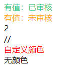

## vue2的工具函数组件，持续更新...

## 功能
回显文本，带颜色的，常用与`el-table`中，其他地方也可用，不用再写多个`v-if`了

## 安装
```
yarn install vue-rui-utils
```

## 使用

#### 引入
```
import { DictColorLabel } from 'vue2-rui-utils'
```
#### 使用
```
<template>
  <div id="app">
   <!--  默认回显  -->
    <dict-color-label :options="auditStatusOptions" :value="1" />
    <dict-color-label :options="auditStatusOptions" :value="0" />
    <!--  找不到值的，默认显示value  -->
    <dict-color-label :options="auditStatusOptions" :value="2" />
    <!--  找不到值的，也可传入显示的文本  -->
    <dict-color-label :options="auditStatusOptions" :value="3" empty-text="//" />
    <!--  支持自定义颜色 color  -->
    <dict-color-label :options="auditStatusOptions" :value="5" />
    <!--  不传颜色  -->
    <dict-color-label :options="auditStatusOptions" :value="6" />
  </div>
</template>

<script>
export default {
  data() {
    return {
      auditStatusOptions: [
        { value: '0', label: '有值：未审核', type: 'warning' },
        { value: '1', label: '有值：已审核', type: 'success' },
        { value: '5', label: '自定义颜色', color: 'red' },
        { value: '6', label: '无颜色', },
      ]
    }
  }
}
</script>
```
#### 效果图



#### options参数说明
###### options { Array } 必传
| 参数    | 说明               | 类型      | 必传 |
|-------|------------------|-----------------|----|
| value | 值                | String / Number | 必传 |
| label | 显示文本             | String | 必传 |
| type | 颜色类型，默认为空，可选值：【success, warning, danger, info】 | String | 非必传 |
| color | 自定义颜色，type为空时生效 | String | 非必传 |
